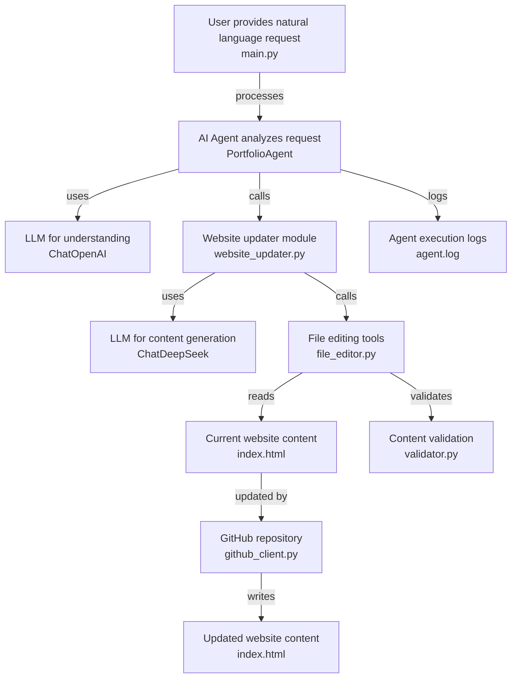
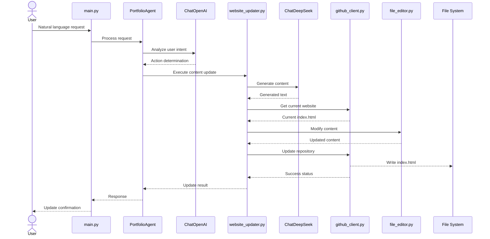
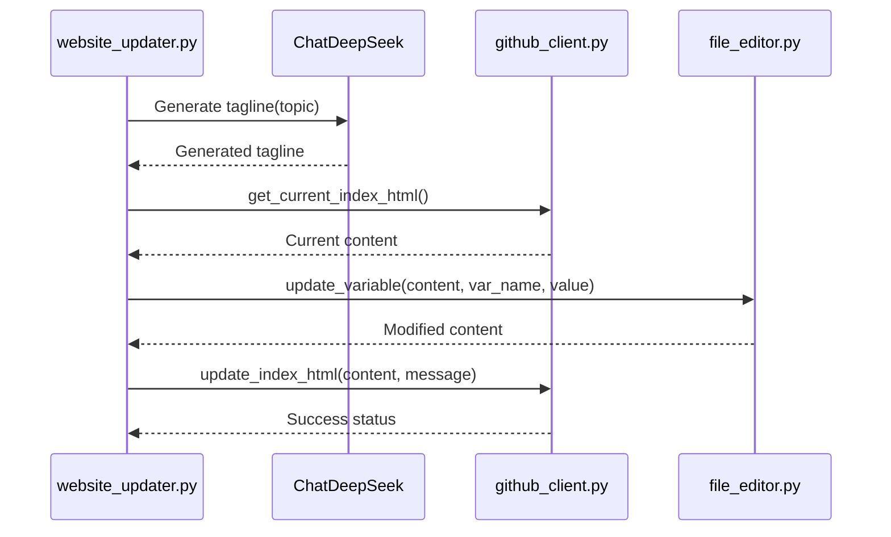
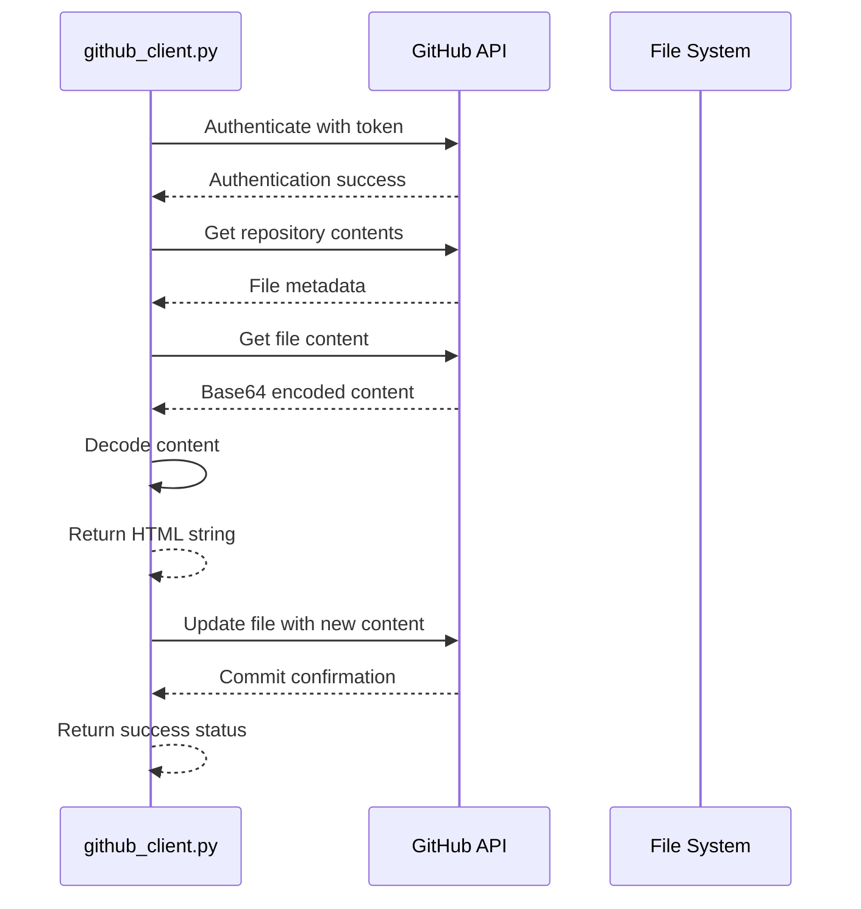
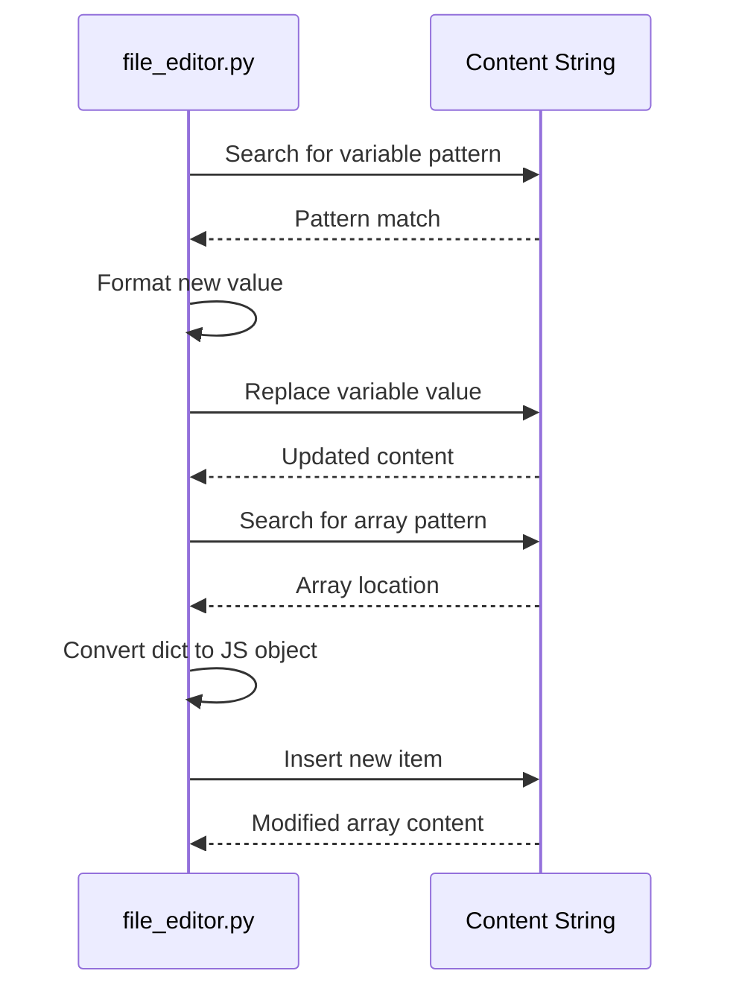

# System Architecture
## by Agent Technical Writer

---

## Solution Overview

This solution provides an intelligent agent that automatically manages and updates a portfolio website through natural language instructions. It enables non-technical users to modify website content without writing code or understanding web development. The system interprets user requests in plain English and translates them into precise website updates. It maintains the website's structure and design while allowing dynamic content changes. The solution ensures all updates follow proper formatting and validation rules. It provides a conversational interface that makes website management accessible and intuitive. The agent handles various content types including project descriptions, personal information, and visual elements. It bridges the gap between creative content ideas and technical implementation. The system operates securely with proper authentication and version control. It transforms how individuals maintain their online presence by automating routine updates.

---

## AI Application

The solution employs a single AI agent that serves as an intelligent website manager. This agent interprets natural language requests from users and determines the appropriate actions to update the portfolio website. It understands context about website structure and content requirements. The agent validates all changes to ensure they maintain website integrity and formatting standards. Its goal is to make website management accessible through conversational interaction without technical expertise.

---

## Data Flow Diagram

---

## Module Description

| Module Name | Functionality | Inputs | Outputs |
|-------------|---------------|--------|---------|
| main.py | Main entry point for the AI agent that processes user requests and coordinates website updates | dotenv, logging, langchain_openai, langchain.agents, langchain.tools, langchain.memory, langchain.prompts, agent.website_updater, agent.github_client, tools.file_editor, tools.validator | Console output, agent.log file |
| agent/website_updater.py | Updates website content using AI-generated text and manages content modifications | dotenv, langchain_deepseek, langchain_core.prompts, .github_client, tools.file_editor | Updated website content strings |
| agent/github_client.py | Handles GitHub repository operations including reading and updating website files | os, base64, github, github.GithubException | Current index.html content, commit status |
| tools/file_editor.py | Provides utilities for editing JavaScript variables and arrays in website files | re | Modified content strings with updated variables and arrays |
| agent/test_deepseek.py | Tests environment configuration for DeepSeek API integration | dotenv, os | Console output showing API key status |

---

## Sequence Diagram

